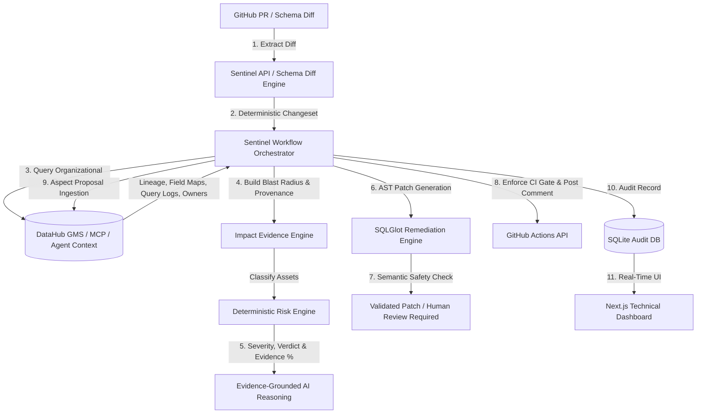

# Sentinel AI

**Know what a data change will break before you merge it — then generate the fix.**

[](LICENSE)
[](https://datahubproject.io)
[](https://datahub.devpost.com/)

> **Sentinel AI** is an autonomous pre-merge change firewall powered by DataHub context. It investigates proposed schema changes before pull requests are merged, verifies the blast radius across DataHub lineage graphs, enforces deterministic merge policy, proposes safely validated remediation, takes approved GitHub & DataHub actions, and writes persistent investigation audit memory back into DataHub.

---

## 1. Problem & Solution

### Problem
Data teams routinely face silent production breaks when upstream schema changes (such as removing a column, changing a data type, or renaming a field) are merged into main branches. Existing tools notify engineers *after* the pipeline or dashboard breaks in production, resulting in emergency fire-fighting, corrupted metrics, and lost trust.

### Solution
Sentinel AI operates **before merge**. When a developer opens a GitHub PR modifying a data model or schema, Sentinel:
1. **Extracts** the actual schema diff from git/PR revisions deterministically.
2. **Queries DataHub** through official MCP / Agent Context capabilities for entity schemas, column lineage, query execution logs, ownership, and domains.
3. **Distinguishes** confirmed downstream consumers (e.g. executive dashboards, ML feature stores) from merely connected assets with explicit provenance.
4. **Calculates** transparent, rule-based severity and a deterministic **Evidence Completeness %** (no fabricated confidence scores).
5. **Generates & Validates** candidate SQLGlot AST remediation patches, enforcing strict semantic safety rules (requiring human review if predicates in `WHERE`, `JOIN`, `HAVING`, or `GROUP BY` are affected).
6. **Enforces** PR policy in GitHub CI (failing closed on `BLOCK` and `INSUFFICIENT_EVIDENCE`), posts review comments, and **writes the investigation outcome back into DataHub**.

---

## 2. Core Differentiator: DataHub vs. Sentinel AI

> [!IMPORTANT]
> **DataHub** is the central system of organizational metadata truth. It knows the entities, schemas, ownership, and multi-hop lineage relationships.
> 
> **Sentinel AI** turns that context into an **autonomous pre-merge control loop**. It evaluates changes before they reach main, computes deterministic risk, enforces CI merge policy, generates validated AST code patches, and writes persistent investigation memory back into DataHub.

---

## 3. System Architecture



---

## 4. 13-Stage Bounded Workflow Machine

Sentinel operates as a 13-stage bounded state machine rather than an uncontrolled LLM loop:

```text
RECEIVE_CHANGE → NORMALIZE_CHANGE → LOAD_DATAHUB_CONTEXT → BUILD_EVIDENCE_GRAPH →
VERIFY_CONSUMERS → COMPUTE_RISK → GENERATE_REMEDIATION → VALIDATE_REMEDIATION →
GENERATE_EXPLANATION → HUMAN_APPROVAL → ACT → WRITE_BACK → COMPLETE
```

Every stage emits structured progress events and writes an audit log entry to SQLite.

---

## 5. DataHub Capabilities Used

Sentinel integrates with native DataHub OpenAPI/GraphQL and MCP capabilities:
- **`get_dataset` / Entities API**: Entity schema fields, technical/business owners, tags, and domain metadata.
- **`get_downstream_lineage` / Graph API**: Table-level and dataset-level multi-hop dependency graph traversal.
- **`get_column_lineage` / Fine-Grained Lineage API**: Field-to-field transformation mapping.
- **`get_dataset_queries` / Query Log API**: Historical SQL query execution logs referencing dataset columns.
- **Writeback (`writeback_investigation`)**: Ingests Sentinel aspect proposals, annotates dataset descriptions, and records persistent investigation audit documents.

---

## 6. Quickstart & Local Setup

### Prerequisites
- Python 3.11+
- Node.js 18+
- Docker & Docker Compose (Optional for live DataHub OSS)

### 1. Clone Repository & Install Backend
```bash
git clone https://github.com/MaharMuavia/sentinelai.git
cd sentinelai
cp .env.example .env

cd apps/api
python -m venv .venv
source .venv/bin/activate  # On Windows: .venv\Scripts\activate
pip install -r requirements.txt
python -m uvicorn app.main:app --reload --port 8000
```

### 2. Start Next.js Frontend
```bash
cd apps/web
npm install
npm run dev
```
Open [http://localhost:3000](http://localhost:3000) in your browser.

### 3. Seed DataHub Demo Scenario
```bash
python scripts/seed_demo.py
```

---

## 7. DataHub Integration Modes & Truthfulness

Sentinel enforces strict evidence truthfulness across three explicit modes:
- **`LIVE_DATAHUB`**: Connected to a live DataHub GMS instance. Evidence items display live tool provenance.
- **`DEMO_FIXTURE`**: Isolated offline demo fixture mode for judge testing and local evaluation. Explicitly labeled in UI and logs.
- **`DATAHUB_UNAVAILABLE`**: DataHub GMS is offline and fixture fallback is disabled. Sentinel returns `0% Evidence Completeness` and verdict `INSUFFICIENT_EVIDENCE` (failing closed).

---

## 8. Reproducible Examples

Judges can inspect real application-generated artifacts in the repository:
- [`examples/critical-schema-removal/`](examples/critical-schema-removal): Full investigation artifacts for breaking `email` column deletion (`input.json`, `evidence.json`, `impact.json`, `investigation.md`, `github-comment.md`, `remediation.patch`, `validation.json`).
- [`examples/safe-additive-change/`](examples/safe-additive-change): Artifacts for non-breaking column addition.

To regenerate artifacts:
```bash
python scripts/generate_examples.py
```

---

## 9. Security & Safety Model

- **Read Operations**: Automated & non-destructive.
- **Safe Write Operations**: DataHub investigation documentation & additive tag ingestion.
- **Semantic Safety Engine**: Automatic patch approval is denied if removed columns are used in `WHERE`, `JOIN`, `HAVING`, or `GROUP BY` predicates.
- **Credential Protection**: Secrets (`DATAHUB_GMS_TOKEN`, `OPENAI_API_KEY`, `GITHUB_TOKEN`) are restricted to backend environment variables and redacted from logs.

---

## 10. Verification & Test Suite

Run backend test suite:
```bash
cd apps/api
pytest tests/
```

Run frontend build verification:
```bash
cd apps/web
npm run build
```

---

## License

Licensed under the [Apache License 2.0](LICENSE).
