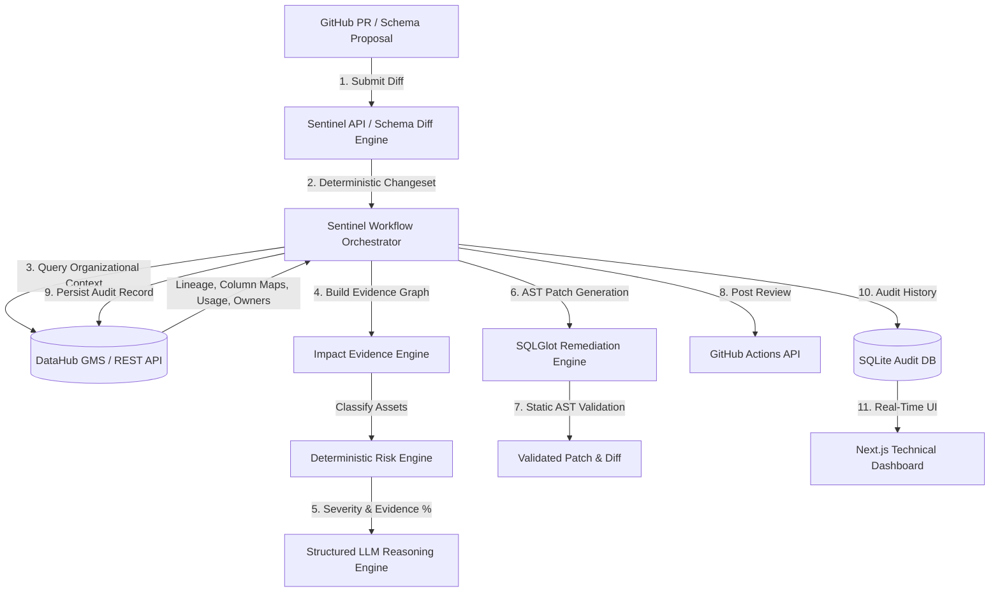

# Sentinel AI

**Know what a data change will break before you merge it — then generate the fix.**

[](LICENSE)
[](https://datahubproject.io)
[]()

> **Sentinel AI** is an autonomous pre-merge Data Reliability Engineer powered by DataHub context. It investigates proposed schema changes before pull requests are merged, builds an evidence-backed impact graph, computes deterministic risk severity and evidence completeness scores, generates and statically validates SQLGlot remediation patches, posts GitHub reviews, and persists the investigation audit record back into DataHub.

---

## 1. Problem & Solution

### Problem
Data teams routinely face silent production breaks when upstream schema changes (such as removing a column, changing a data type, or renaming a field) are merged into main branches. Existing tools notify engineers *after* the pipeline or dashboard breaks in production, resulting in emergency fire-fighting, corrupted metrics, and lost trust.

### Solution
Sentinel AI runs **before merge**. When a developer opens a GitHub PR modifying a data model or schema, Sentinel:
1. **Normalizes** the proposed schema diff deterministically.
2. **Queries DataHub** for verified lineage, fine-grained column mapping, query execution history, ownership, and business domains.
3. **Distinguishes** confirmed downstream consumers (e.g. executive dashboards, ML feature stores) from merely connected assets.
4. **Calculates** transparent, rule-based severity and a deterministic **Evidence Completeness %** (no fabricated confidence scores).
5. **Generates & Validates** an AST-level remediation patch using SQLGlot.
6. **Posts** a structured review comment to GitHub and **writes the investigation document back into DataHub**.

---

## 2. Core Differentiator: DataHub vs. Sentinel AI

> [!IMPORTANT]
> **DataHub** is the system of organizational metadata truth. It provides dataset entities, lineage relationships, and usage metrics.
> 
> **Sentinel AI** is the autonomous change control agent that consumes DataHub context to make an actionable pre-merge decision (`BLOCK`, `SAFE_TO_MERGE`, `MERGE_WITH_CAUTION`), generate AST-validated remediation code, and write persistent audit records back into DataHub.

---

## 3. System Architecture



---

## 4. 13-Stage Bounded Workflow Machine

Sentinel operates as a bounded state machine rather than an uncontrolled LLM loop:

```text
RECEIVE_CHANGE → NORMALIZE_CHANGE → LOAD_DATAHUB_CONTEXT → BUILD_EVIDENCE_GRAPH →
VERIFY_CONSUMERS → COMPUTE_RISK → GENERATE_EXPLANATION → GENERATE_REMEDIATION →
VALIDATE_REMEDIATION → HUMAN_APPROVAL → ACT → WRITE_BACK → COMPLETE
```

Every stage emits structured progress events and writes an immutable entry to the SQLite audit log.

---

## 5. DataHub Capabilities Used

Sentinel uses native DataHub REST/GMS capabilities:
- **`get_dataset` / `get_entities`**: Schema fields, technical/business owners, tags, and domain metadata.
- **`get_downstream_lineage`**: Table-level and dataset-level dependency graph traversal.
- **`get_column_lineage`**: Fine-grained field-to-field transformation mapping.
- **`get_dataset_queries`**: Historical SQL query execution logs referencing dataset columns.
- **Writeback (`writeback_investigation`)**: Ingests Sentinel aspect proposals, annotates dataset descriptions, and records persistent investigation audit documents.

---

## 6. Quickstart & Local Setup

### Prerequisites
- Python 3.11+
- Node.js 18+
- Docker & Docker Compose (Optional for live DataHub OSS)

### 1. Clone & Configure Environment
```bash
git clone https://github.com/acme/sentinelai.git
cd sentinelai
cp .env.example .env
```

### 2. Start Backend API
```bash
cd apps/api
python -m venv .venv
source .venv/bin/activate  # On Windows: .venv\Scripts\activate
pip install -r requirements.txt
python -m uvicorn app.main:app --reload --port 8000
```

### 3. Start Next.js Frontend
```bash
cd apps/web
npm install
npm run dev
```
Open [http://localhost:3000](http://localhost:3000) in your browser.

### 4. Seed DataHub Demo Scenario
```bash
python scripts/seed_demo.py
```

---

## 7. 3-Minute Video Demo Scenario Alignment

1. **0:00–0:15 (Problem)**: Show raw customer schema and proposed PR removing `customers.email`.
2. **0:15–0:30 (Analyze)**: Open Sentinel UI (`/analyze`), click **Load Hackathon Demo Scenario**, and hit **Analyze Proposed Change**.
3. **0:30–1:00 (Workflow)**: Live 13-stage workflow progress tracker executes in real-time.
4. **1:00–1:30 (Hero View)**: Hero detail screen displays `BLOCK MERGE`, `CRITICAL` severity, and `94% Evidence Completeness`.
5. **1:30–2:00 (Impact Graph)**: Interactive React Flow blast-radius visualization highlights confirmed consumer nodes (`customer_360`, `marketing_dashboard`, `churn_model`) vs. unaffected node (`billing_dashboard`).
6. **2:00–2:25 (Remediation)**: SQLGlot AST remediation engine displays validated `.patch` diff and syntax verification.
7. **2:25–2:45 (GitHub & DataHub)**: Click **Persist to DataHub** and **Post Review to GitHub** to demonstrate end-to-end integration writeback.
8. **2:45–3:00 (Conclusion)**: "DataHub knows your data stack. Sentinel uses that context to stop breaking changes before they ship."

---

## 8. Reproducible Examples

Judges can inspect real application-generated artifacts in the repository:
- [`examples/critical-schema-removal/`](examples/critical-schema-removal): Full investigation artifacts for breaking `email` column deletion (`input.json`, `evidence.json`, `impact.json`, `investigation.md`, `github-comment.md`, `remediation.patch`, `validation.json`).
- [`examples/safe-additive-change/`](examples/safe-additive-change): Artifacts for non-breaking column addition.

---

## 9. Security & Safety Model

- **Read Operations**: Automated & non-destructive.
- **Safe Write Operations**: DataHub investigation documentation & metadata tagging.
- **External Code Modification**: Requires explicit human-in-the-loop approval dialog before opening GitHub branches or PRs. Never automatically merges PRs.
- **Credential Protection**: Secrets (`DATAHUB_GMS_TOKEN`, `OPENAI_API_KEY`, `GITHUB_TOKEN`) are restricted to backend environment variables and redacted from logs.

---

## 10. Verification & Test Suite

Run backend test suite:
```bash
cd apps/api
pytest tests/
```

Run frontend build verification:
```bash
cd apps/web
npm run build
```

---

## License

Licensed under the [Apache License 2.0](LICENSE).
